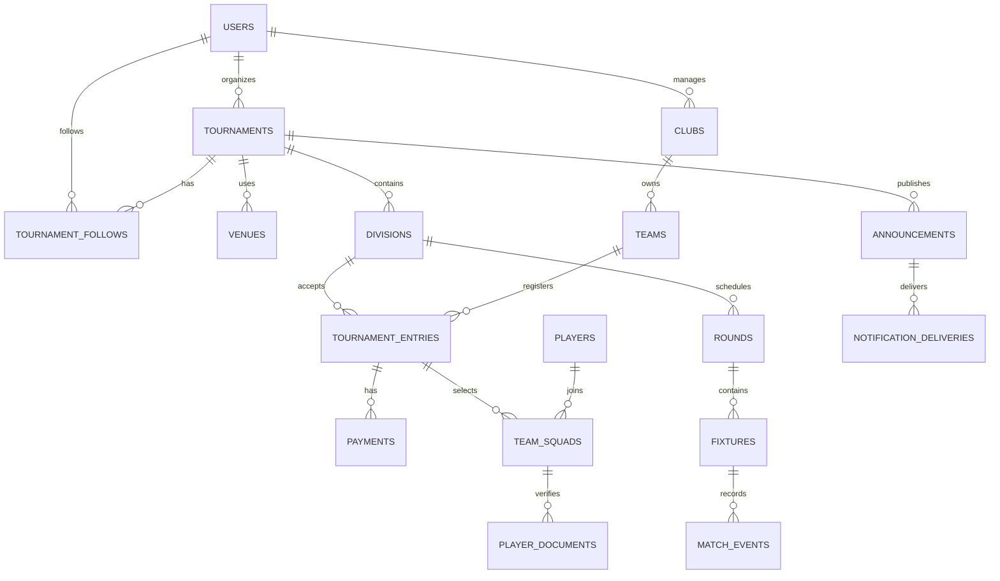

# MyFootball India - product and database blueprint

## What this first build covers

The deployed web application follows the requirement document's Release 1 journey:

1. Adaptive tournament creation for light weekend cups and professional academy events.
2. Team-only registration as the first-release default, with optional player and age-document controls ready for later releases.
3. Round-based fixture generation using teams, format, pitches, match duration, breaks, buffers and minimum rest.
4. Matchday score and event entry.
5. Live group tables, form and leaderboards.
6. Organizer navigation and an account-ready structure.
7. Participant announcements and delivery status.
8. Unified accounts with state, city and locality-based tournament discovery.
9. Exact venue addresses, PIN codes, map coordinates and saved tournament follows.
10. Persistent light and dark appearance modes.

Organizer identity and ownership are checked server-side. Tournament, division, club, team, entry, fixture, event and announcement records are stored in a durable relational database. Public registration links create real pending entries that organizers can approve and manage. Manual fee status is supported; online payment collection remains disabled until merchant credentials are supplied.

## Positive changes to the original ERD

The original diagram had a good foundation: users, competitions, clubs, age groups and teams. The revised design keeps those concepts but makes the following changes:

- `competitions` becomes `tournaments`, while `age_groups` becomes `divisions`. A division owns its format, capacity, fee, scoring rules and registration requirements.
- Venues are normalized instead of stored as JSON, so fixtures can reliably target a venue and pitch.
- A team is a reusable club team. Its participation in a division is stored in `tournament_entries`, including approval, seeding and withdrawal/barred states.
- Payments belong to an entry and retain an auditable provider reference and status history.
- Players and squad membership are separate, allowing one player identity to participate in different tournaments without duplicating core details.
- Rounds and fixtures model league, knockout and mixed formats. Fixtures store scheduling and score state; match events store goals, assists, cards, saves, fouls and substitutions.
- Announcements and notification deliveries support participant messaging, channel state and read status.
- Tournament files and player verification documents use object-storage keys rather than database blobs.
- Dates use explicit start/end values and timestamps use the Asia/Kolkata tournament timezone instead of a derived `duration_days` field.
- Money is stored as integer paise to avoid decimal rounding errors.
- Fan follows are modeled as a many-to-many relationship instead of being embedded in a user or tournament row.
- A tournament location requires a venue name, street address, locality, city, state, six-digit PIN code and latitude/longitude, so discovery and navigation do not depend on an ambiguous city name.

## Relationship map

## Current and future architecture

- Responsive web client with a TypeScript API and deployed relational database.
- Secure authentication with server-side tournament ownership checks; the fan/organizer preference only controls the default home screen.
- Searchable fan discovery by tournament, venue, locality, city, state and PIN code.
- Public, capacity-checked team registration endpoints.
- Generated fixtures, persisted match events and calculated standings.
- Future object storage for posters, regulations and player documents.
- Future standalone phone/email authentication when MyFootball moves beyond its current hosted environment.
- Razorpay or another India-ready provider for UPI and fee collection; verify webhooks server-side.
- Background jobs for fixture notifications and delivery retries.
- WebSocket or server-sent events for public live scores.
- A shared API contract so a later Flutter or React Native app uses the same backend and database.

## Sensible release sequence

### Release 1 - validate demand

- Organizer account and onboarding
- Tournament/division creation
- Team-only registration
- Manual payment confirmation plus optional online payment
- Round fixture generation and publication
- Basic score entry, standings and shareable public pages
- Participant announcements
- Fan accounts, area discovery and tournament follows
- Exact geocoded tournament locations

### Release 2 - deeper operations

- Player profiles, squads and age-document verification
- Detailed events: assists, saves, cards, fouls and substitutions
- Referee/official roles
- Automated payment reconciliation and refunds
- Push notifications and WhatsApp integration

### Release 3 - network and mobile

- Dedicated mobile apps using the same API
- Club and player discovery
- Historical rankings and seeding
- Multi-organizer permissions, sponsors and white-label public pages

## India-specific safeguards

- Request Aadhaar only when there is a clear, lawful age-verification need; avoid making it the default identity document.
- Encrypt sensitive documents, use short-lived access links, log access and define deletion periods.
- Obtain explicit consent for player data and guardian consent for minors.
- Keep payment success dependent on signed provider webhooks, never only on a client callback.
- Retain an audit trail for result corrections, eligibility reviews, team barring and refunds.
