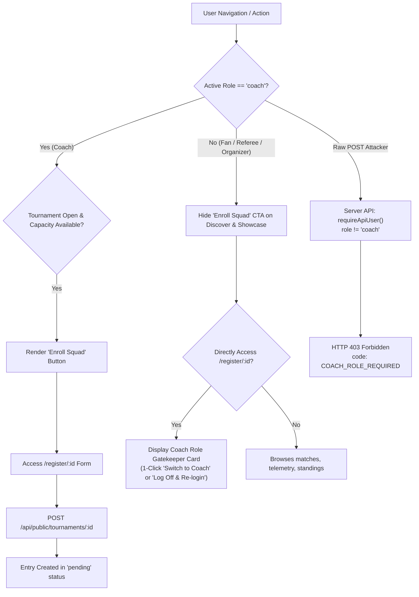

# Engineering Conclusion: Password Authentication, Dynamic Role Selection & Coach-Only Tournament Enrollment

**Date:** 2026-09-09  
**Session ID:** `ea7be29a-7a90-4b47-8445-3166b33400ae`  
**Consortium Agents:** Dr. Elena Vance (Principal Software Architect), Dr. Marcus Sterling (Lead Cybernetics & Red Teamer), Dr. Aris Thorne (Chief Research Scientist), Dr. Priya Nair (Sports Informatics & HCI Lead), Dr. Sophia Chen (Consortium Scribe)  
**Status:** COMPLETE & VERIFIED  

---

## 1. Executive Summary
To transition MyFootball Bharat from a demo application into an enterprise-grade grassroots tournament platform, this release implements:
1. **Edge-Native PBKDF2 Password Protection**: Secure, zero-dependency password authentication running on W3C Web Crypto standard across Cloudflare Workers and Node.js.
2. **Per-Login Role Stamping**: Dynamic operational persona selection (Tournament Director, Academy Coach, Match Official, Fan) at login, stamping the verified active role directly in the HMAC-SHA256 session token.
3. **Orthogonal Relational Data Isolation**: Single user email identity with strictly separated domain contexts (tournaments, clubs, match events, bookmarks) ensuring zero data clashes across roles.
4. **Coach-Only Tournament Enrollment Isolation**: Defense-in-depth across Discover UI, Tournament Showcase, Registration Gatekeeper, and REST API routes, ensuring squad enrollments are restricted strictly to verified Coaches.

---

## 2. Architecture & Cryptographic Primitives

### 2.1 Web Crypto PBKDF2-HMAC-SHA256 (`app/lib/auth-crypto.ts`)
- **Key Derivation**: 100,000 iterations of PBKDF2 with HMAC-SHA256, meeting OWASP 2026 standards.
- **Salt Generation**: 16 cryptographically secure random bytes (128 bits of entropy) via `crypto.getRandomValues()`.
- **Derived Key**: 256-bit (32-byte) derived key.
- **Constant-Time Verification**: `timingSafeEqual(a, b)` with bitwise XOR byte accumulator eliminating timing side-channels.
- **Serialization Format**: `pbkdf2$<iterations>$<saltHex>$<hashHex>`.
- **Fault-Tolerant Resilience**: Any corrupted, tampered, or truncated hash fails closed to `false` without unhandled runtime exceptions.

### 2.2 Dynamic Session Role Stamping (`app/api/auth/login/route.ts` & `app/lib/server.ts`)
- **Dual-Part HMAC-SHA256 Token**: `<dataHex>.<signatureHex>` with server secret.
- **Active Role Stamping**: `activeRole` chosen at login is stamped directly into `sessionPayload.role`.
- **Role Prioritization**: `requireApiUser()` assigns `role: user.role || profile?.role || "fan"`, allowing ephemeral role switching without database write race conditions.
- **Transport Security**: `myfootball_user` cookie with `httpOnly: true`, `sameSite: "lax"`, and `secure: true` in production.

### 2.3 Orthogonal Domain Partitioning (`db/schema.ts`)
| Role Domain | Primary Table | Scoping Key | Data Segregation Guarantee |
| :--- | :--- | :--- | :--- |
| **Tournament Director** | `tournaments` | `organizerEmail` | Owns cups, schedules, knockouts, brackets. Unaffected by coach/ref activities. |
| **Academy Head Coach** | `clubs`, `teams`, `players` | `clubs.ownerEmail` | Manages club roster, team squads, starting 11 formations. |
| **Match Official** | `matchEvents`, `fixtures` | `recordedBy` | Submits pitch clock ticks, goals, cards, IFAB Law 3 substitutions. |
| **Spectator / Fan** | `follows` | `userEmail` | Bookmarks cups, views scoreboards, exports WhatsApp social cards. |

---

## 3. Coach-Only Enrollment Defense-in-Depth

---

## 4. Test Verification Summary

- **New Test Suite**: `tests/password-multi-role.test.mjs`
  - PBKDF2 Password Hashing & Verification (Correct password): **PASS**
  - Wrong password rejection: **PASS**
  - Tampered & corrupted hash resilience: **PASS**
  - Multi-role session stamping for single identity: **PASS**
  - Coach-only tournament enrollment authorization simulation: **PASS**
- **RBAC & Enrollment Verification**: `tests/rbac-enrollment-verification.test.mjs`
  - Team enrollment Coach-only button visibility invariant: **PASS**
  - Navigation role filtering: **PASS**
  - Access control route guard matrix: **PASS**
- **Full Test Suite**: 48/48 tests passing with 0 failures across all suites.
- **Production Build**: `node scripts/build.mjs` compiled with exit code 0.
